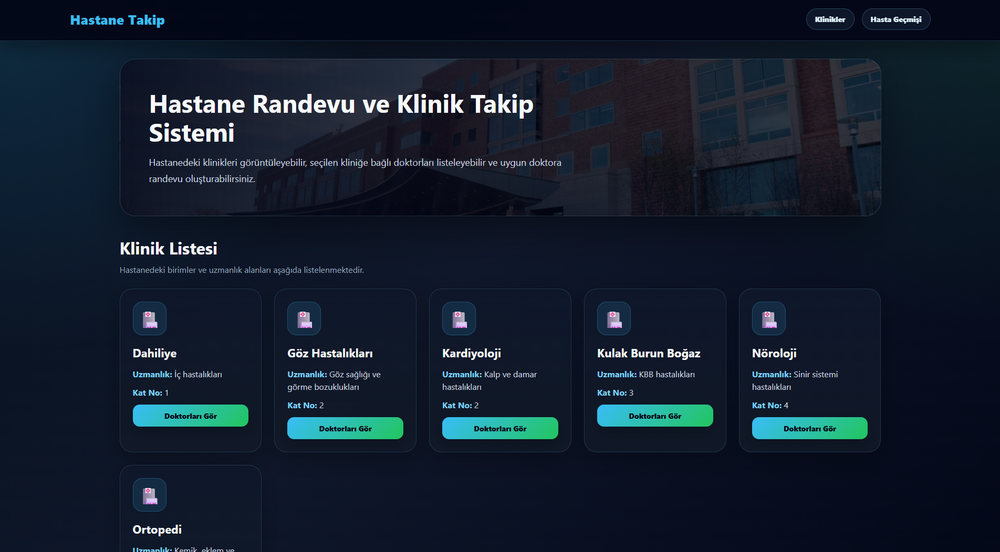
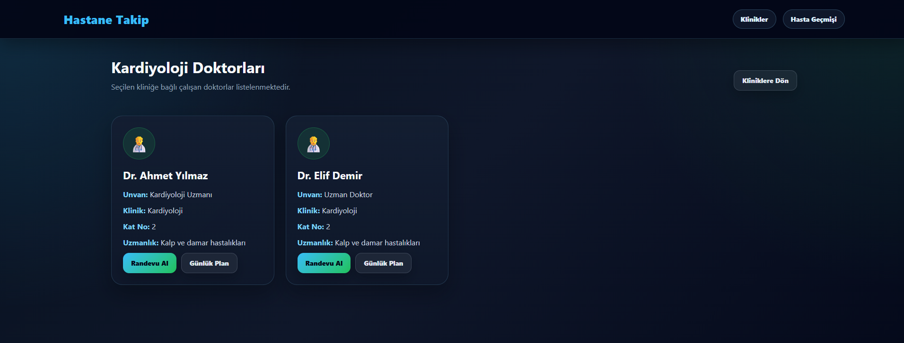
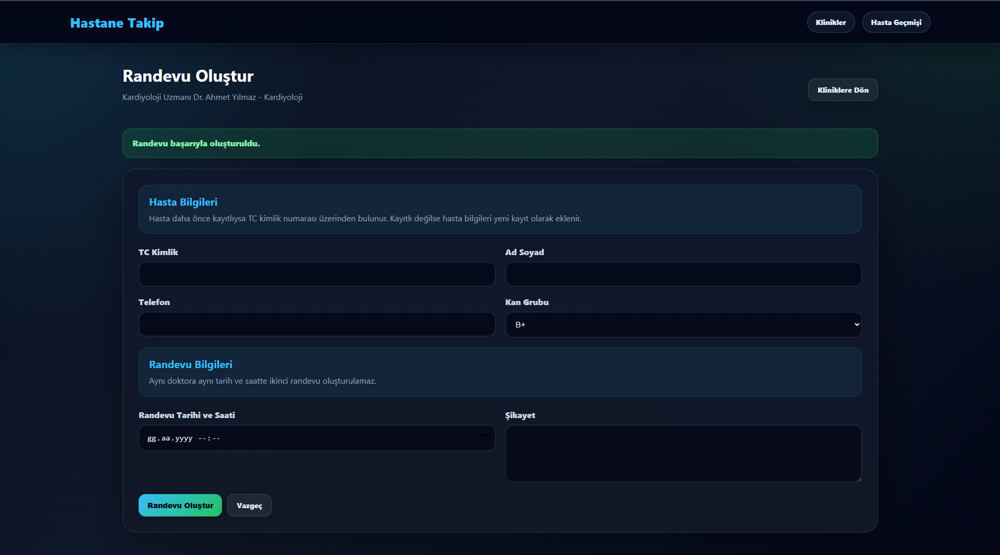
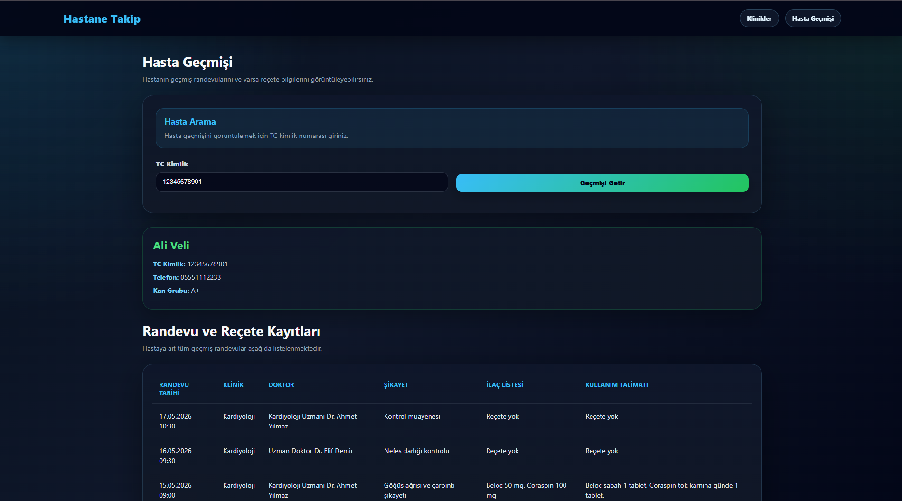
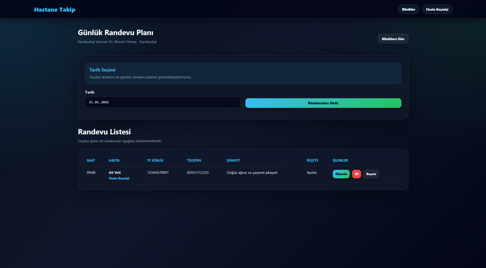
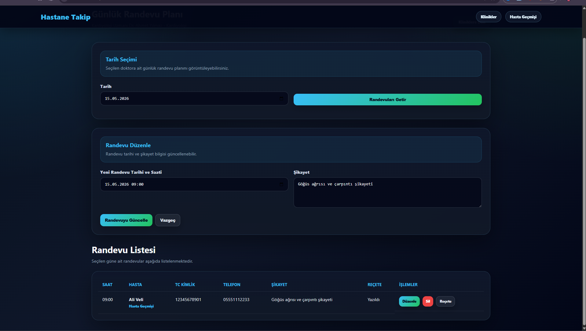
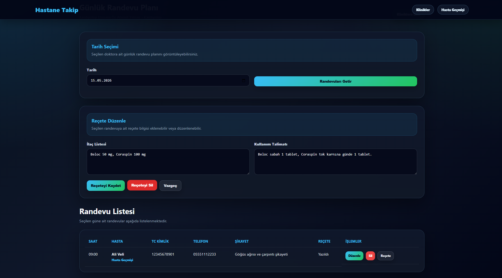

# Hastane Randevu ve Klinik Takip Sistemi

Bu proje, ASP.NET Web Forms ve MS SQL Server kullanılarak geliştirilmiş basit bir hastane randevu ve klinik takip uygulamasıdır.

Uygulamada klinikler, doktorlar, hastalar, randevular ve reçeteler yönetilebilmektedir.  
Kullanıcılar klinikleri görüntüleyebilir, seçilen kliniğe bağlı doktorları listeleyebilir, doktora randevu oluşturabilir, hasta geçmişini görüntüleyebilir ve doktorun günlük randevu planı üzerinden randevu/reçete işlemlerini takip edebilir.

---

## Projenin Amacı

Bu projenin amacı, ASP.NET Web Forms ve MS SQL Server kullanarak ilişkisel veri tabanı yapısına sahip bir hastane takip sistemi geliştirmektir.

Projede veri tutarlılığına dikkat edilmiş, hasta ve randevu işlemlerinde parametreli SQL sorguları kullanılmıştır.

Sistem temel olarak şu işlemleri yapmaktadır:

- Klinik listeleme
- Kliniğe bağlı doktorları görüntüleme
- Hasta bilgileri ile randevu oluşturma
- Hasta geçmişini görüntüleme
- Doktorun günlük randevu planını görüntüleme
- Randevu düzenleme
- Randevu silme
- Reçete ekleme
- Reçete düzenleme
- Reçete silme

---

## Kullanılan Teknolojiler

- ASP.NET Web Forms
- C#
- MS SQL Server
- ADO.NET
- SqlConnection
- SqlCommand
- SqlDataAdapter
- HTML
- CSS
- Visual Studio

---

## Uygulama Özellikleri

- Hastanedeki klinikler listelenir.
- Her kliniğe bağlı doktorlar görüntülenir.
- Seçilen doktora hasta bilgileri girilerek randevu oluşturulur.
- Hasta daha önce kayıtlıysa TC kimlik numarası üzerinden tekrar eklenmez.
- Aynı doktora aynı tarih ve saatte ikinci randevu oluşturulması engellenir.
- Hasta geçmişi TC kimlik numarası ile görüntülenebilir.
- Hasta geçmişinde randevular ve varsa reçete bilgileri listelenir.
- Doktor bazlı günlük randevu planı görüntülenebilir.
- Günlük randevu planı üzerinden randevu düzenleme ve silme işlemleri yapılabilir.
- Günlük randevu planı üzerinden reçete ekleme, düzenleme ve silme işlemleri yapılabilir.

---

# Veri Tabanı Tasarımı

Projede MS SQL Server veri tabanı kullanılmıştır. Veri tabanı toplam 5 tablodan oluşmaktadır.

## Veri Tabanı Adı

```sql
HastaneRandevuDB
```

## Tablolar

1. `Clinics`
2. `Doctors`
3. `Patients`
4. `Appointments`
5. `Prescriptions`

---

## 1. `Clinics` Tablosu

Bu tablo hastanedeki klinik bilgilerini tutar.

| Sütun Adı | Veri Tipi | Açıklama |
|---|---|---|
| ID | INT | Klinik için benzersiz ID değeridir. Birincil anahtar olarak kullanılır. |
| KlinikAdi | NVARCHAR(100) | Kliniğin adını tutar. |
| KatNo | INT | Kliniğin bulunduğu kat bilgisini tutar. |
| Uzmanlik | NVARCHAR(100) | Kliniğin uzmanlık alanını tutar. |

### Örnek Kayıtlar

| ID | KlinikAdi | KatNo | Uzmanlik |
|---|---|---|---|
| 1 | Kardiyoloji | 2 | Kalp ve damar hastalıkları |
| 2 | Ortopedi | 3 | Kemik, eklem ve kas hastalıkları |
| 3 | Nöroloji | 4 | Sinir sistemi hastalıkları |
| 4 | Dahiliye | 1 | İç hastalıkları |

---

## 2. `Doctors` Tablosu

Bu tablo doktor bilgilerini tutar.

| Sütun Adı | Veri Tipi | Açıklama |
|---|---|---|
| ID | INT | Doktor için benzersiz ID değeridir. Birincil anahtar olarak kullanılır. |
| KlinikID | INT | Doktorun bağlı olduğu kliniği belirtir. `Clinics` tablosuna bağlıdır. |
| AdSoyad | NVARCHAR(150) | Doktorun ad ve soyad bilgisini tutar. |
| Unvan | NVARCHAR(100) | Doktorun unvan bilgisini tutar. |

### İlişki

`Doctors.KlinikID` alanı, `Clinics.ID` alanına bağlıdır.

Bir klinikte birden fazla doktor bulunabilir.  
Bir doktor yalnızca bir kliniğe bağlıdır.

### Örnek Kayıtlar

| ID | KlinikID | AdSoyad | Unvan |
|---|---|---|---|
| 1 | 1 | Dr. Ahmet Yılmaz | Kardiyoloji Uzmanı |
| 2 | 1 | Dr. Elif Demir | Uzman Doktor |
| 3 | 2 | Dr. Mehmet Kaya | Ortopedi Uzmanı |
| 4 | 2 | Dr. Selin Arslan | Operatör Doktor |

---

## 3. `Patients` Tablosu

Bu tablo hasta bilgilerini tutar.

| Sütun Adı | Veri Tipi | Açıklama |
|---|---|---|
| ID | INT | Hasta için benzersiz ID değeridir. Birincil anahtar olarak kullanılır. |
| TCKimlik | NVARCHAR(11) | Hastanın TC kimlik numarasını tutar. |
| AdSoyad | NVARCHAR(150) | Hastanın ad ve soyad bilgisini tutar. |
| Telefon | NVARCHAR(20) | Hastanın telefon bilgisini tutar. |
| KanGrubu | NVARCHAR(10) | Hastanın kan grubu bilgisini tutar. |

### Kullanım Mantığı

Randevu oluşturulurken hasta önce TC kimlik numarası ile aranır.

Hasta daha önce kayıtlıysa mevcut hasta kaydı kullanılır.  
Hasta kayıtlı değilse yeni hasta kaydı oluşturulur.

### Örnek Kayıtlar

| ID | TCKimlik | AdSoyad | Telefon | KanGrubu |
|---|---|---|---|---|
| 1 | 12345678901 | Ali Veli | 05551112233 | A+ |
| 2 | 23456789012 | Fatma Demir | 05552223344 | B+ |
| 3 | 34567890123 | Mehmet Yıldırım | 05553334455 | 0+ |
| 4 | 45678901234 | Ayşe Kaya | 05554445566 | AB+ |

---

## 4. `Appointments` Tablosu

Bu tablo randevu bilgilerini tutar.

| Sütun Adı | Veri Tipi | Açıklama |
|---|---|---|
| ID | INT | Randevu için benzersiz ID değeridir. Birincil anahtar olarak kullanılır. |
| HastaID | INT | Randevu alan hastayı belirtir. `Patients` tablosuna bağlıdır. |
| DoktorID | INT | Randevu alınan doktoru belirtir. `Doctors` tablosuna bağlıdır. |
| RandevuTarihi | DATETIME | Randevunun tarih ve saat bilgisini tutar. |
| Sikayet | NVARCHAR(MAX) | Hastanın şikayet bilgisini tutar. |

### İlişki

`Appointments.HastaID` alanı, `Patients.ID` alanına bağlıdır.  
`Appointments.DoktorID` alanı, `Doctors.ID` alanına bağlıdır.

Bir hastanın birden fazla randevusu olabilir.  
Bir doktorun birden fazla randevusu olabilir.

### Sistem Kontrolü

Aynı doktora aynı tarih ve saatte ikinci randevu oluşturulması engellenmiştir.

### Örnek Kayıtlar

| ID | HastaID | DoktorID | RandevuTarihi | Sikayet |
|---|---|---|---|---|
| 1 | 1 | 1 | 2026-05-15 09:00 | Göğüs ağrısı ve çarpıntı |
| 2 | 2 | 3 | 2026-05-15 10:00 | Diz ağrısı |
| 3 | 3 | 5 | 2026-05-15 11:00 | Baş ağrısı |
| 4 | 4 | 7 | 2026-05-15 13:30 | Mide ağrısı |

---

## 5. `Prescriptions` Tablosu

Bu tablo randevulara ait reçete bilgilerini tutar.

| Sütun Adı | Veri Tipi | Açıklama |
|---|---|---|
| ID | INT | Reçete için benzersiz ID değeridir. Birincil anahtar olarak kullanılır. |
| RandevuID | INT | Reçetenin bağlı olduğu randevuyu belirtir. `Appointments` tablosuna bağlıdır. |
| IlacListesi | NVARCHAR(MAX) | Yazılan ilaçların listesini tutar. |
| KullanimTalimati | NVARCHAR(MAX) | İlaçların kullanım talimatını tutar. |

### İlişki

`Prescriptions.RandevuID` alanı, `Appointments.ID` alanına bağlıdır.

Bir randevuya reçete yazılabilir.  
Hasta geçmişi ve günlük randevu planı sayfalarında reçete bilgileri görüntülenebilir.

### Örnek Kayıtlar

| ID | RandevuID | IlacListesi | KullanimTalimati |
|---|---|---|---|
| 1 | 1 | Beloc 50 mg, Coraspin 100 mg | Beloc sabah 1 tablet, Coraspin tok karnına |
| 2 | 2 | Parol 500 mg, Kas gevşetici krem | Parol ağrı olduğunda, krem günde 2 kez |
| 3 | 3 | Majezik 100 mg | Tok karnına alınacak |

---

# Tablolar Arası İlişkiler

| Ana Tablo | Bağlı Tablo | İlişki Türü | Açıklama |
|---|---|---|---|
| Clinics | Doctors | 1 - N | Bir klinikte birden fazla doktor bulunabilir. |
| Doctors | Appointments | 1 - N | Bir doktorun birden fazla randevusu olabilir. |
| Patients | Appointments | 1 - N | Bir hastanın birden fazla randevusu olabilir. |
| Appointments | Prescriptions | 1 - 1 | Bir randevuya bir reçete yazılabilir. |

---

# İlişki Şeması

```txt
Clinics 1 -------- N Doctors

Doctors 1 -------- N Appointments

Patients 1 ------- N Appointments

Appointments 1 --- 1 Prescriptions
```

Açıklama:

- Bir klinik birden fazla doktora sahip olabilir.
- Bir doktor bir kliniğe bağlıdır.
- Bir doktorun birden fazla randevusu olabilir.
- Bir hasta birden fazla randevu alabilir.
- Bir randevuya reçete yazılabilir.
- Reçete bilgisi randevu üzerinden hasta geçmişinde görüntülenebilir.

---

# Örnek Veri Akışı

1. Kullanıcı ana sayfada klinikleri görüntüler.
2. Bir kliniğin “Doktorları Gör” butonuna tıklar.
3. Seçilen kliniğe ait doktorlar listelenir.
4. Kullanıcı bir doktordan randevu almak için “Randevu Al” butonuna tıklar.
5. Hasta bilgileri, randevu tarihi ve şikayet bilgisi girilir.
6. Hasta daha önce kayıtlıysa mevcut hasta kaydı kullanılır.
7. Hasta kayıtlı değilse yeni hasta kaydı oluşturulur.
8. Aynı doktora aynı tarih ve saatte randevu yoksa randevu oluşturulur.
9. Hasta geçmişi sayfasında TC kimlik ile hastanın geçmiş randevuları görüntülenir.
10. Günlük randevu planı sayfasında doktorun seçilen güne ait randevuları listelenir.
11. Günlük randevu planından randevu düzenlenebilir, silinebilir veya reçete işlemleri yapılabilir.

---

# Proje Sayfaları

| Sayfa | Açıklama |
|---|---|
| `Default.aspx` | Ana sayfadır. Hastanedeki klinikleri listeler. |
| `Doktor.aspx` | Seçilen kliniğe bağlı doktorları listeler. |
| `RandevuOlustur.aspx` | Seçilen doktora randevu oluşturma ekranıdır. |
| `HastaGecmisi.aspx` | TC kimlik veya patientId ile hasta geçmişini gösterir. |
| `GunlukRandevuPlani.aspx` | Doktorun günlük randevu planını gösterir. |
| `Web.config` | Veri tabanı bağlantı ayarlarını içerir. |
| `style.css` | Uygulamanın arayüz tasarımını içerir. |
| `database.sql` | Veri tabanı ve tabloları oluşturur. |
| `seed.sql` | Örnek verileri ekler. |

---

# Kullanılan Temel SQL Sorguları

## Klinik Listesi

```sql
SELECT 
    ID,
    KlinikAdi,
    KatNo,
    Uzmanlik
FROM Clinics
ORDER BY KlinikAdi ASC;
```

---

## Kliniğe Göre Doktor Listeleme

```sql
SELECT 
    Doctors.ID,
    Doctors.AdSoyad,
    Doctors.Unvan,
    Clinics.KlinikAdi,
    Clinics.KatNo,
    Clinics.Uzmanlik
FROM Doctors
INNER JOIN Clinics ON Doctors.KlinikID = Clinics.ID
WHERE Doctors.KlinikID = @clinicId
ORDER BY Doctors.AdSoyad ASC;
```

---

## Hasta TC Kimlik Kontrolü

```sql
SELECT ID
FROM Patients
WHERE TCKimlik = @TCKimlik;
```

---

## Randevu Çakışma Kontrolü

```sql
SELECT COUNT(*)
FROM Appointments
WHERE DoktorID = @DoktorID
AND RandevuTarihi = @RandevuTarihi;
```

---

## Randevu Oluşturma

```sql
INSERT INTO Appointments
(HastaID, DoktorID, RandevuTarihi, Sikayet)
VALUES
(@HastaID, @DoktorID, @RandevuTarihi, @Sikayet);
```

---

## Hasta Geçmişi Listeleme

```sql
SELECT 
    Appointments.ID,
    Appointments.RandevuTarihi,
    Appointments.Sikayet,
    Doctors.AdSoyad AS DoktorAdi,
    Doctors.Unvan,
    Clinics.KlinikAdi,
    ISNULL(Prescriptions.IlacListesi, '') AS IlacListesi,
    ISNULL(Prescriptions.KullanimTalimati, '') AS KullanimTalimati
FROM Appointments
INNER JOIN Doctors ON Appointments.DoktorID = Doctors.ID
INNER JOIN Clinics ON Doctors.KlinikID = Clinics.ID
LEFT JOIN Prescriptions ON Appointments.ID = Prescriptions.RandevuID
WHERE Appointments.HastaID = @HastaID
ORDER BY Appointments.RandevuTarihi DESC;
```

---

## Günlük Randevu Planı

```sql
SELECT
    Appointments.ID,
    Appointments.HastaID,
    Appointments.RandevuTarihi,
    Appointments.Sikayet,
    Patients.AdSoyad AS HastaAdi,
    Patients.TCKimlik,
    Patients.Telefon,
    ISNULL(Prescriptions.ID, 0) AS ReceteID
FROM Appointments
INNER JOIN Patients ON Appointments.HastaID = Patients.ID
LEFT JOIN Prescriptions ON Appointments.ID = Prescriptions.RandevuID
WHERE Appointments.DoktorID = @DoktorID
AND CAST(Appointments.RandevuTarihi AS DATE) = @Tarih
ORDER BY Appointments.RandevuTarihi ASC;
```

---

# CRUD İşlemleri

| İşlem | Sayfa | Açıklama |
|---|---|---|
| Read | `Default.aspx` | Klinikler listelenir. |
| Read | `Doktor.aspx` | Kliniğe bağlı doktorlar listelenir. |
| Create | `RandevuOlustur.aspx` | Hasta kontrolü yapılarak randevu oluşturulur. |
| Read | `HastaGecmisi.aspx` | Hasta geçmişi ve reçete bilgileri görüntülenir. |
| Read | `GunlukRandevuPlani.aspx` | Doktorun günlük randevuları listelenir. |
| Update | `GunlukRandevuPlani.aspx` | Randevu bilgileri düzenlenir. |
| Delete | `GunlukRandevuPlani.aspx` | Randevu kaydı silinir. |
| Create | `GunlukRandevuPlani.aspx` | Randevuya reçete eklenir. |
| Update | `GunlukRandevuPlani.aspx` | Reçete bilgileri düzenlenir. |
| Delete | `GunlukRandevuPlani.aspx` | Reçete kaydı silinir. |

---

# Örnek Klinikler

| Klinik | Kat No | Uzmanlık |
|---|---|---|
| Kardiyoloji | 2 | Kalp ve damar hastalıkları |
| Ortopedi | 3 | Kemik, eklem ve kas hastalıkları |
| Nöroloji | 4 | Sinir sistemi hastalıkları |
| Dahiliye | 1 | İç hastalıkları |
| Göz Hastalıkları | 2 | Göz sağlığı ve görme bozuklukları |
| Kulak Burun Boğaz | 3 | KBB hastalıkları |

---

# Örnek Doktorlar

| Doktor | Klinik | Unvan |
|---|---|---|
| Dr. Ahmet Yılmaz | Kardiyoloji | Kardiyoloji Uzmanı |
| Dr. Elif Demir | Kardiyoloji | Uzman Doktor |
| Dr. Mehmet Kaya | Ortopedi | Ortopedi Uzmanı |
| Dr. Selin Arslan | Ortopedi | Operatör Doktor |
| Dr. Burak Çelik | Nöroloji | Nöroloji Uzmanı |

---

# Örnek Hastalar

| TC Kimlik | Hasta | Kan Grubu |
|---|---|---|
| 12345678901 | Ali Veli | A+ |
| 23456789012 | Fatma Demir | B+ |
| 34567890123 | Mehmet Yıldırım | 0+ |
| 45678901234 | Ayşe Kaya | AB+ |
| 56789012345 | Hasan Çelik | A- |

---


## Veri Tabanı Kurulumu

1. MS SQL Server üzerinde yeni bir veri tabanı oluşturulur.

```sql
CREATE DATABASE HastaneRandevuDB;
```

2. `database.sql` dosyası çalıştırılarak tablolar oluşturulur.

3. `seed.sql` dosyası çalıştırılarak örnek veriler eklenir.

4. `Web.config` dosyasındaki bağlantı ayarı kontrol edilir.

```xml
<connectionStrings>
  <add 
    name="HastaneDB"
    connectionString="Data Source=localhost;Initial Catalog=HastaneRandevuDB;Integrated Security=True;TrustServerCertificate=True"
    providerName="System.Data.SqlClient" />
</connectionStrings>
```

SQL Server Express kullanılıyorsa bağlantı şu şekilde düzenlenebilir:

```xml
Data Source=.\SQLEXPRESS;
```

---

# Ekran Görüntüleri

## Klinik Listesi



## Doktor Seçimi



## Randevu Oluştur



## Hasta Geçmişi



## Günlük Randevu Planı



## Randevu Düzenleme



## Reçete İşlemleri



---

# Geliştirici

**Sedat Avcı**

Bu proje, Veri Tabanı Yönetim Sistemleri dersi kapsamında ödev amacıyla hazırlanmıştır.

---

# Sonuç

Bu proje ile ASP.NET Web Forms ve MS SQL Server kullanılarak hastane randevu ve klinik takip sistemi geliştirilmiştir.

Projede klinikler, doktorlar, hastalar, randevular ve reçeteler ilişkisel veri tabanı yapısıyla yönetilmiştir.

Uygulamada klinik listeleme, doktor seçimi, randevu oluşturma, hasta geçmişi görüntüleme, günlük randevu planı, randevu düzenleme/silme ve reçete ekleme/düzenleme/silme işlemleri yapılabilmektedir.

Veri güvenliği açısından SQL işlemlerinde parametreli sorgular kullanılmıştır.