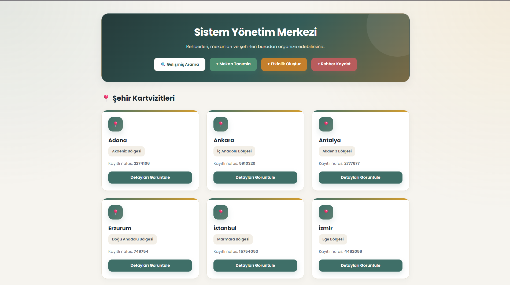
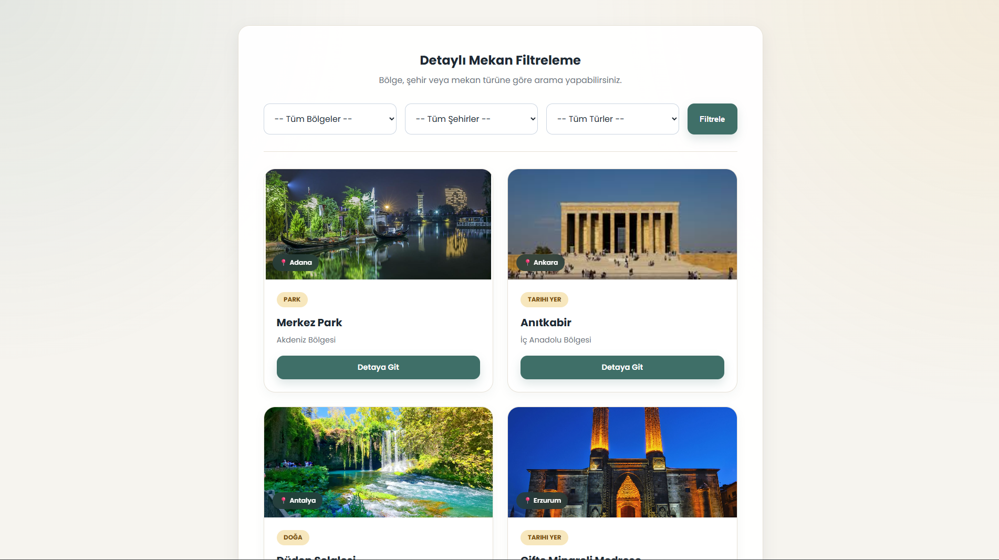
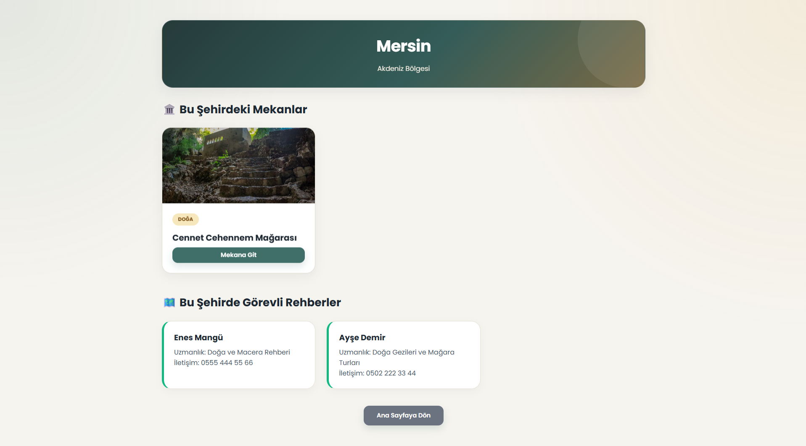
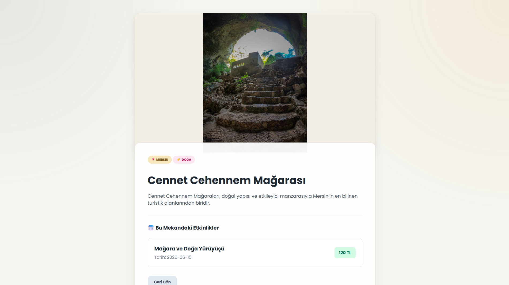
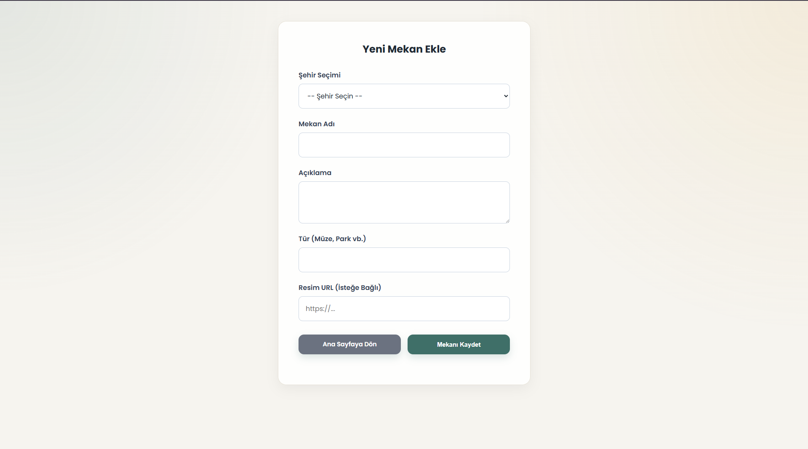
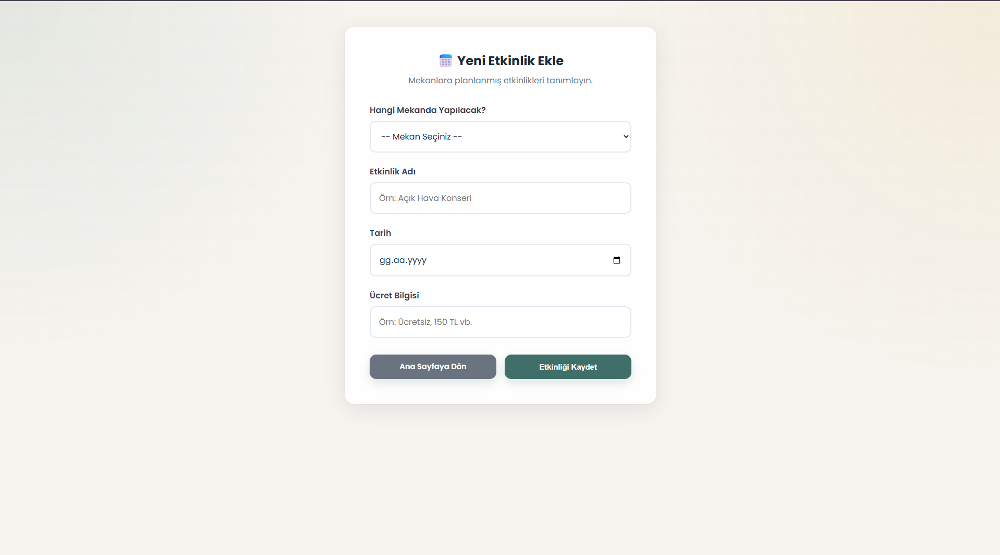
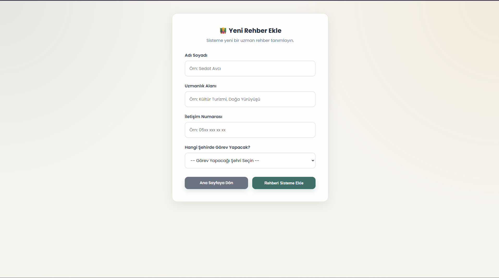
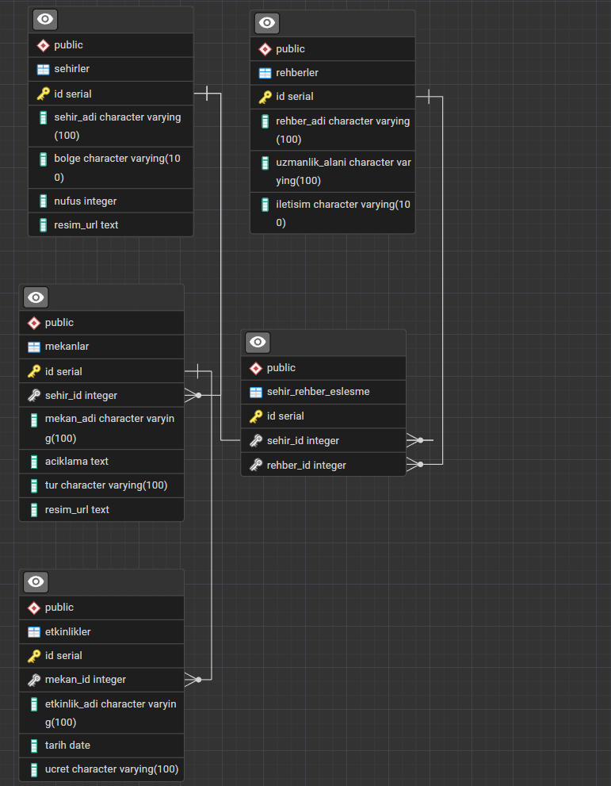

# Şehir Rehberi Web Uygulaması

Bu proje, JSP ve PostgreSQL kullanılarak geliştirilmiş basit bir şehir rehberi uygulamasıdır.  
Uygulamada şehirler, şehirlerdeki mekanlar, mekanlara bağlı etkinlikler ve şehirlerde görevli rehberler yönetilebilmektedir.

## Projenin Amacı

Bu projenin amacı, veri tabanı ilişkilerini kullanarak şehir, mekan, etkinlik ve rehber bilgilerinin web arayüzü üzerinden listelenmesini ve yönetilmesini sağlamaktır.

## Kullanılan Teknolojiler

- Java JSP
- PostgreSQL
- JDBC
- HTML
- CSS
- Apache Tomcat
- NetBeans

## Uygulama Özellikleri

- Şehirleri listeleme
- Şehirlere ait mekanları görüntüleme
- Mekan detaylarını görüntüleme
- Mekanlara ait etkinlikleri listeleme
- Yeni mekan ekleme
- Yeni etkinlik ekleme
- Yeni rehber ekleme
- Rehberleri şehirlerle ilişkilendirme
- Bölge, şehir ve mekan türüne göre arama / filtreleme

---

# Veri Tabanı Tasarımı

Projede PostgreSQL veri tabanı kullanılmıştır. Veri tabanı toplam 5 tablodan oluşmaktadır.

## 1. `sehirler` Tablosu

Bu tablo şehir bilgilerini tutar.

| Sütun Adı | Veri Tipi | Açıklama |
|---|---|---|
| id | SERIAL | Birincil anahtar |
| sehir_adi | VARCHAR(100) | Şehrin adı |
| bolge | VARCHAR(100) | Şehrin bulunduğu bölge |
| nufus | INTEGER | Şehrin nüfusu |
| resim_url | TEXT | Şehre ait görsel bağlantısı |

---

## 2. `mekanlar` Tablosu

Bu tablo şehirlerde bulunan mekan bilgilerini tutar.

| Sütun Adı | Veri Tipi | Açıklama |
|---|---|---|
| id | SERIAL | Birincil anahtar |
| sehir_id | INTEGER | Mekanın bağlı olduğu şehir |
| mekan_adi | VARCHAR(100) | Mekanın adı |
| aciklama | TEXT | Mekan açıklaması |
| tur | VARCHAR(100) | Mekanın türü |
| resim_url | TEXT | Mekana ait görsel bağlantısı |

### İlişki

`mekanlar.sehir_id` alanı, `sehirler.id` alanına bağlıdır.

Bir şehirde birden fazla mekan bulunabilir.

---

## 3. `etkinlikler` Tablosu

Bu tablo mekanlara ait etkinlikleri tutar.

| Sütun Adı | Veri Tipi | Açıklama |
|---|---|---|
| id | SERIAL | Birincil anahtar |
| mekan_id | INTEGER | Etkinliğin yapılacağı mekan |
| etkinlik_adi | VARCHAR(100) | Etkinlik adı |
| tarih | DATE | Etkinlik tarihi |
| ucret | VARCHAR(100) | Etkinlik ücret bilgisi |

### İlişki

`etkinlikler.mekan_id` alanı, `mekanlar.id` alanına bağlıdır.

Bir mekanda birden fazla etkinlik yapılabilir.

---

## 4. `rehberler` Tablosu

Bu tablo rehber bilgilerini tutar.

| Sütun Adı | Veri Tipi | Açıklama |
|---|---|---|
| id | SERIAL | Birincil anahtar |
| rehber_adi | VARCHAR(100) | Rehberin adı |
| uzmanlik_alani | VARCHAR(100) | Rehberin uzmanlık alanı |
| iletisim | VARCHAR(100) | Rehberin iletişim bilgisi |

---

## 5. `sehir_rehber_eslesme` Tablosu

Bu tablo şehirler ile rehberler arasındaki ilişkiyi tutar.

| Sütun Adı | Veri Tipi | Açıklama |
|---|---|---|
| id | SERIAL | Birincil anahtar |
| sehir_id | INTEGER | Şehir ID değeri |
| rehber_id | INTEGER | Rehber ID değeri |

### İlişki

`sehir_rehber_eslesme.sehir_id` alanı, `sehirler.id` alanına bağlıdır.  
`sehir_rehber_eslesme.rehber_id` alanı, `rehberler.id` alanına bağlıdır.

Bu tablo sayesinde bir şehre bir veya birden fazla rehber atanabilir.

---

# Tablolar Arası İlişkiler

| Ana Tablo | Bağlı Tablo | İlişki Türü | Açıklama |
|---|---|---|---|
| sehirler | mekanlar | 1 - N | Bir şehirde birden fazla mekan bulunabilir |
| mekanlar | etkinlikler | 1 - N | Bir mekanda birden fazla etkinlik olabilir |
| sehirler | sehir_rehber_eslesme | 1 - N | Bir şehir birden fazla rehberle eşleşebilir |
| rehberler | sehir_rehber_eslesme | 1 - N | Bir rehber birden fazla şehirde görev alabilir |

---

# Örnek Veri Akışı

1. Kullanıcı ana sayfada şehirleri görüntüler.
2. Bir şehre tıklayınca o şehirdeki mekanlar listelenir.
3. Kullanıcı bir mekanı seçince mekan detayları ve etkinlikleri görüntülenir.
4. Kullanıcı yeni mekan, etkinlik veya rehber ekleyebilir.
5. Arama sayfasında bölge, şehir ve mekan türüne göre filtreleme yapılabilir.

---

# Proje Sayfaları

| Sayfa | Açıklama |
|---|---|
| index.jsp | Ana sayfa, şehirleri ve son eklenen mekanları listeler |
| arama.jsp | Bölge, şehir ve tür bilgisine göre mekan filtreleme sayfası |
| sehir_detaylari.jsp | Seçilen şehre ait mekanları ve rehberleri gösterir |
| mekan_detaylari.jsp | Seçilen mekanın detaylarını ve etkinliklerini gösterir |
| yeni_mekan_ekle.jsp | Yeni mekan ekleme sayfası |
| yeni_etkinlik_ekle.jsp | Yeni etkinlik ekleme sayfası |
| yeni_rehber_ekle.jsp | Yeni rehber ekleme ve şehirle eşleştirme sayfası |

---

# Örnek Mekanlar

| Şehir | Mekan | Tür |
|---|---|---|
| Erzurum | Çifte Minareli Medrese | Tarihi Yer |
| Mersin | Cennet Cehennem Mağarası | Doğa |
| Adana | Merkez Park | Park |
| İstanbul | Ayasofya Camii | Tarihi Yer |
| Ankara | Anıtkabir | Tarihi Yer |
| İzmir | Efes Antik Kenti | Tarihi Yer |
| Antalya | Düden Şelalesi | Doğa |

---

## Veri Tabanı Kurulumu

Projede PostgreSQL kullanılmıştır.

1. PostgreSQL üzerinde yeni bir veritabanı oluşturun.
2. Önce `database.sql` dosyasını çalıştırın.
3. Daha sonra örnek veriler için `seed.sql` dosyasını çalıştırın.
4. `DBConnection.java` dosyasında veritabanı adı, kullanıcı adı ve şifre bilgilerini kendi bilgisayarınıza göre düzenleyin.

---

# Geliştirici

**Sedat Avcı**

Bu proje, veri tabanı yönetim sistemleri dersi kapsamında ödev amacıyla hazırlanmıştır.

# Ekran Görüntüleri

## Ana Sayfa

## Gelişmiş Arama Sayfası

## Şehir Detay Sayfası

## Mekan Detay Sayfası

## Yeni Mekan Ekleme Sayfası

## Yeni Etkinlik Ekleme Sayfası

## Yeni Rehber Ekleme Sayfası

## Veri Tabanı Şeması

